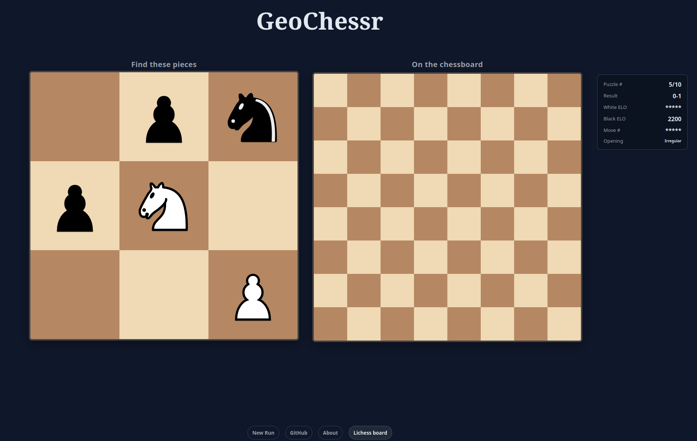

# GeoChessr

This is GeoChessr, a website inspired by [GeoGuessr](https://www.geoguessr.com/) and [Wordle](https://www.nytimes.com/games/wordle/index.html), that lets you guess where pieces have been on the chessboard in real chess games from [lichess](https://lichess.org/).

The idea for this project came up when hanging out with friends on discord, and so I will attribute the idea for GeoChessr to all of us, [mansimum](https://lichess.org/@/mansimum), [pixler](https://lichess.org/@/pixler), [philantrop](https://lichess.org/@/Philantrop) and finally me, [kappablanc](https://lichess.org/@/kappablanc).

However, this website itself has been fully ideated and developed by me, [Yannik Keller](https://github.com/yannikkellerde).

Big shoutout to [lichess](https://github.com/lichess-org), the forever free and open source chess engine that both lets me use its piece designs and has an awesome api that lets me easily grab games for geochessr automatically. I love you lichess!

© 2025 Yannik Keller
Licensed under the GNU General Public License v3.0.  
